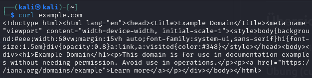
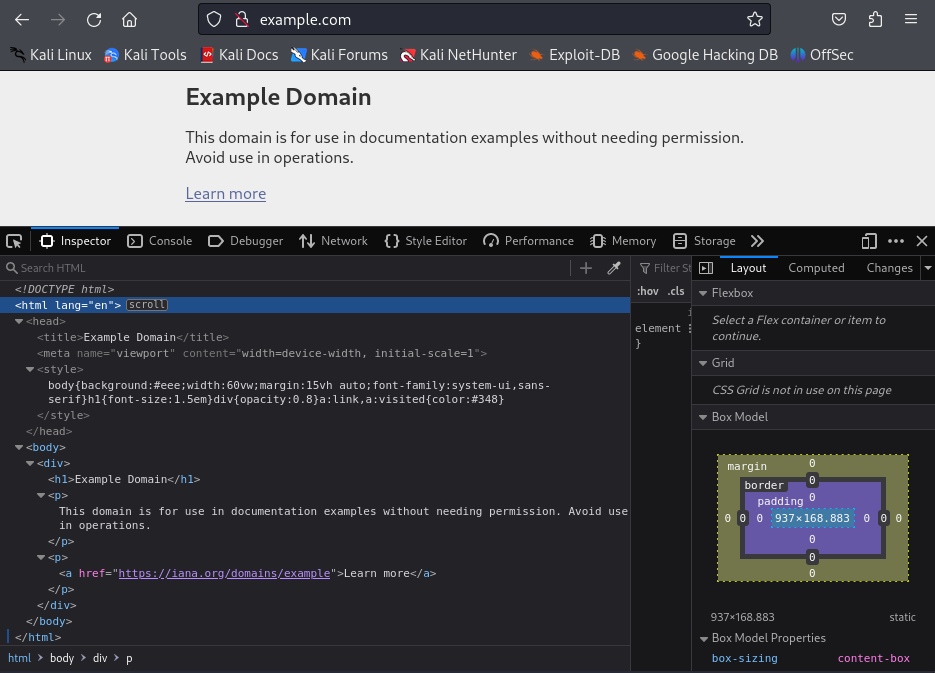
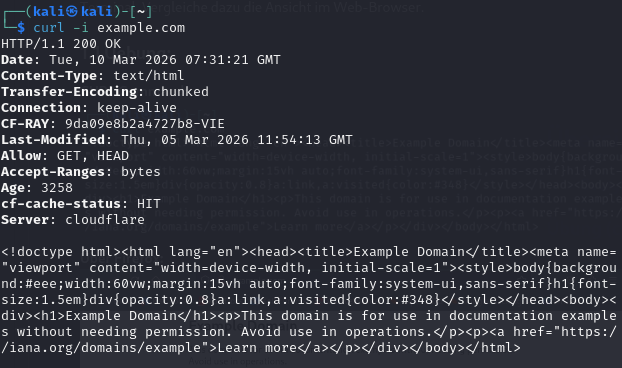
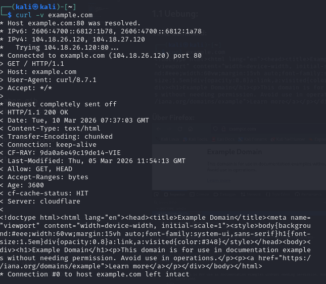
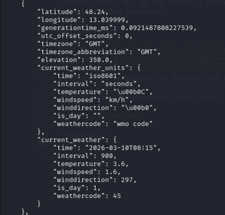
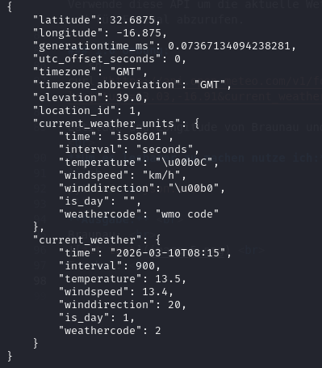

# Arbeitsbericht

|  |  |
| :--- | :--- |
| **Datum:** | 10.03.2026 |
| **Thema:** | Arbeitsbericht über cURL |
| **Name:** | Elia Albenberger |
| **Klasse:** | 3AHITS |
| **Fach:** | SYTB |
|||

# Uebersicht

- ****1. Uebung (curl)****

## 1. Uebung (curl)

### 1.1 Angabe:
Rufe die Startseite von example.com mit curl ab. Du siehst den HTML Code der Seite im Terminal. Vergleiche dazu die Ansicht im Web-Browser.

### 1.1 Uebung:
**CURL Command:**

**Über Firefox:**


### 1.2 Angabe:
Rufe dieselbe Seite wie in Aufgabe 1 auf, aber gib zusätzlich den HTTP-Response-Header aus. Hinweis: Es gibt dafür eine eigene curl-Option.

Du siehst dann sogenannte Meta-Informationen, das sind Informationen über die Web-Site (z.B.date, content-type) und den Server – die aber vom Browser nicht angezeigt werden.

### 1.2 Uebung:

```sh
curl -i example.com
```


### 1.3 Angabe:
Verbose Mode. Rufe eine beliebige URL auf und aktiviere den Verbose Mode, sodass Request, Response und Header sichtbar sind.

### 1.3 Uebung:
```sh
curl -v example.com
```



### 1.4 Angabe: 
Rufe diesen [Link](https://httpbin.org/status/404) mit curl auf, verwende die Option aus der vorangegangenen Aufgabenstellung. Recherchiere: Was bedeutet dieser http Status Code? Was zeigt ein Web-Browser bei Aufruf dieser URL an?

### 1.4 Uebung:
```sh
curl -v https://httpbin.org/status/404
```

http Status Code ist teil der 4xx-Client-Fehler. Heißt dass der Server die Anfrage erreicht hat aber der Fehler auf der Seite des Anfragenden liegt

Im Web-Browser wird eine leere weiße Seite angezeigt

### 1.5 Angabe:
Geschlechtsschätzung anhand von Namen. Lade https://api.genderize.io/ mit curl → du bekommst eine Fehlermeldung. Ein Parameter wird an die URL so angefügt: ```?name=value```. Ermittle das wahrscheinliche Geschlecht von: Noor, Ariel, Amina, Elowen, Levin. Hinweis: verwende Quotes ("<URL>") in der curl Kommandozeile, da ? in der shell eine spezielle Bedeutung hat.

Das Datenformat, das hier vom Server gesendet wird, ist JSON. Ganz viele Web-APIs verwenden JSON. Verwende die Option zum Anzeigen des Response-Headers und suche darin nach einem Hinweis auf dieses Datenformat.

### 1.5 Uebung:

```sh
curl "https://api.genderize.io/?name="  
```
**Noor      =** ```female```    <br>
**Ariel     =** ```male```      <br>
**Amina     =** ```female```    <br>
**Elowen    =** ```female```    <br>
**Levin     =** ```male```      <br>


### 1.6 Angabe:
In einer URL sind auch mehrere Parameter möglich – diese sind mit einem & getrennt:
```
?para1=value1&para2=value2.
```
Aufgabe: Unter dem API Endpoint https://api.open-meteo.com/v1/forecast gibt es Wetter Informationen. Die notwendigen Parameter sind latitude, longitude, und current_weather (Wetter-Beispiel). Verwende diese API um die aktuelle Wetterinformation für Braunau und für Funchal abzurufen.

### 1.6 Uebung:
```sh
curl "https://api.open-meteo.com/v1/forecast?latitude=48.25,32.65&longitude=13.03,-16.91&current_weather=true" | python3 -m json.tool
```
Latitude und Longitude von Braunau und Funchal mit "," getrennt. <br>
**Um es lesbarer zu machen nutze ich:**
```sh
python3 -m json.tool
```
**Ausgabe:** <br>
Braunau: <br>
 <br>
Funchal: <br>



### 1.7 Angabe:
JSON-Ausgaben sind kompakt und daher manchmal sehr schwer zu lesen. Pipe die Ausgabe von curl in das Tool jq, um zu formatieren.